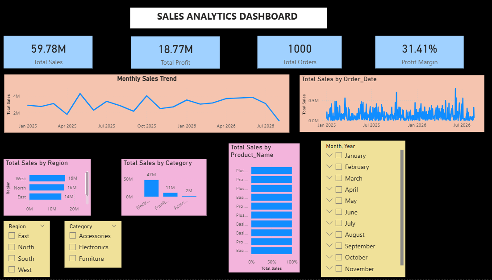

# Sales Analytics Dashboard

## Project Overview

This project is a Sales Analytics Dashboard built using Microsoft Power BI to analyze sales performance, profitability, regional performance, and product category trends.
## Business Objectives

- Analyze overall sales and profitability performance.
- Compare sales performance across different regions.
- Identify the best-performing product categories.
- Monitor key business KPIs such as Total Sales, Total Cost, Total Profit, and Profit Margin.
- Provide an interactive dashboard for business performance analysis.
## Dataset

The dataset contains sales transaction data with information related to:

- Order ID
- Product
- Customer
- Order Date
- Sales Amount
- Quantity
- Cost
- Profit
- Region
- Product Category
## Tools & Technologies

- Power BI Desktop
- Power Query
- DAX
- SQL Server
- Git
- GitHub
- Visual Studio Code
## Data Model

The project uses a Star Schema data model.

### Tables

- **Orders** – Fact table containing sales transactions.
- **Products** – Dimension table containing product information.
- **Customers** – Dimension table containing customer information.

### Relationships

- Products (1) → Orders (Many)
- Customers (1) → Orders (Many)
## Key KPIs

| KPI | Value |
|---|---:|
| Total Sales | 59.78M |
| Total Cost | 41.00M |
| Total Profit | 18.77M |
| Profit Margin | 31.41% |
## Dashboard Features

- Interactive sales performance dashboard.
- KPI cards for Total Sales, Total Cost, Total Profit, and Profit Margin.
- Sales analysis by region.
- Sales analysis by product category.
- Year-wise sales and profitability analysis.
- Interactive filters and slicers for business analysis.
## Key Insights

- West region recorded the highest sales among all regions.
- Electronics was the highest-performing product category by sales.
- Sales performance varied across regions and product categories.
- Profit margin remained above 30% across the analyzed years.
## Project Structure

```text
Sales_Analytics/
│
├── Sales_Analytics.pbix
├── dashboard.png
├── README.md
└── .gitignore 
```
## Dashboard Preview

